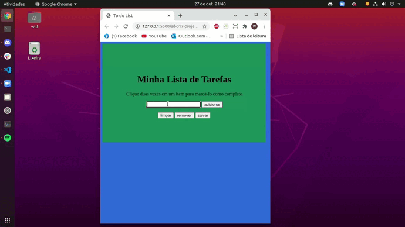

### Observação

Arquivos do projeto **script.js**, **index.html** e **style.css**.

Este repositório contem o Projeto Lista de Tarefas que reúne o aprendizado desenvolvido por _[Willian Alves Batista](https://www.linkedin.com/in/willian-alves-batista-60aa6a180/)_ enquanto estudante da [Trybe](https://www.betrybe.com/) :rocket:

# Projeto Lista de Tarefas
### Resultado obtido:

#### Habilidades exigidas:

  - Manipular o DOM.
  - Manipular o Javascript (funções, loop e eventos).

#### Requisitos obrigatórios:

  - Adicone à sua lista o título "Minha Lista de Tarefas" em uma tag.
  - Adicione abaixo do título um pequeno e discreto parágrafo com id="funcionamento" e com o texto "Clique duas vezes em um item para marcá-lo como completo".
  - Adicione um input com o id="texto-tarefa" onde o usuário poderá digitar o nome do item que deseja adicionar à lista.
  - Adicione uma lista ordenada de tarefas com o id="lista-tarefas".
  - Adicione um botão com id="criar-tarefa" e, ao clicar nesse botão, um novo item deverá ser criado ao final da lista e o texto do input deve ser limpo.
  - Ordene os itens da lista de tarefas por ordem de criação.
  - Clicar em um item da lista deve alterar a cor de fundo do item para cinza rgb(128,128,128).
  - Não deve ser possível selecionar mais de um elemento da lista ao mesmo tempo.
  - Clicar duas vezes em um item, faz com que ele seja riscado, indicando que foi completo. Deve ser possível desfazer essa ação clicando novamente duas vezes no item.
  - Adicione um botão com id="apaga-tudo" que quando clicado deve apagar todos os itens da lista.
  - Adicione um botão com id="remover-finalizados" que quando clicado remove somente os elementos finalizados da sua lista.
  - Adicione um botão com id="salvar-tarefas" que salve o conteúdo da lista. Se você fechar e reabrir a página, a lista deve continuar no estado em que estava.

### Trybe

_"A Trybe é uma escola do futuro para qualquer pessoa que queira melhorar de vida e construir uma carreira de sucesso em tecnologia, onde a pessoa só paga quando conseguir um bom trabalho."_
